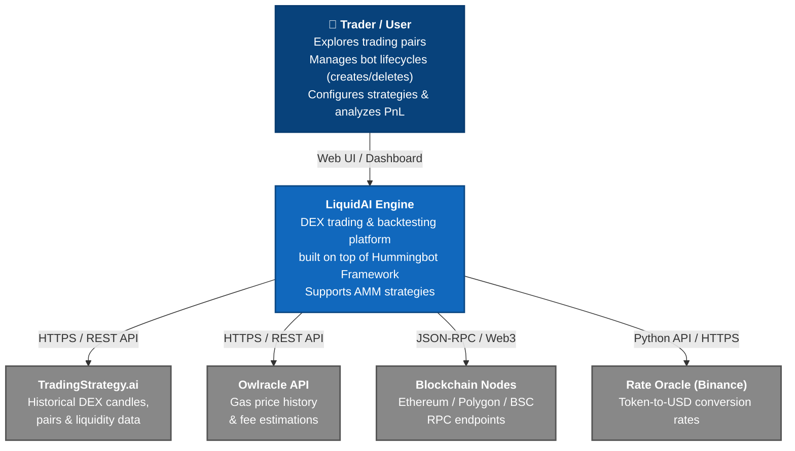
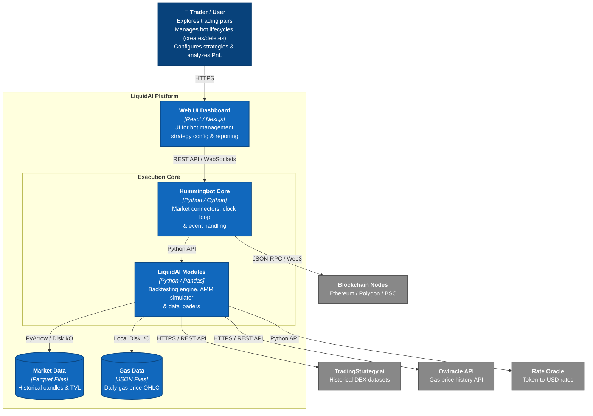
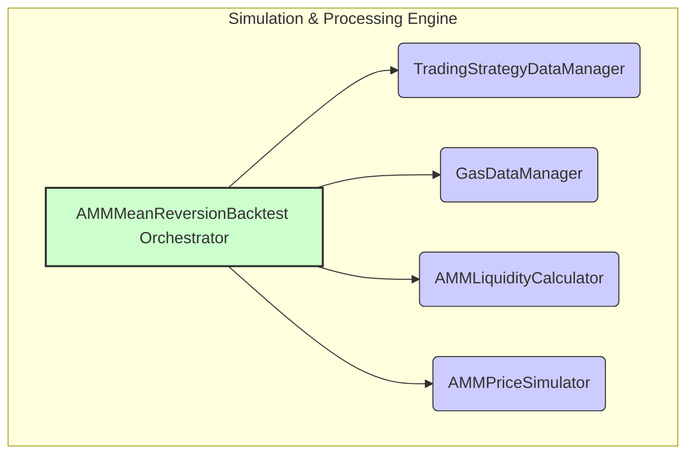

# Architecture: C4 Model Overview

This document provides a high-level architectural overview of the LiquidAI Trading & Backtesting Engine using the **C4 Model** methodology. 

It maps the system from the highest level of abstraction (Context) down to internal components and data structures, serving as an entry point to the detailed technical documentation.

---

## Level 1: System Context (C1)

The System Context diagram shows the LiquidAI platform as a whole and its interactions with users and external systems.

---

## Level 2: Container Diagram (C2)

Zooming into the `LiquidAI Engine`, the Container diagram shows the executables, data storage technologies, and how responsibilities are distributed across the system.

---

## Level 3: Component Diagram (C3)

Zooming into the `LiquidAI Modules` container, we expose the isolated domain components that demonstrate our **Separation of Concerns**:

> **Detailed component specifications:**
> * [**AMMMeanReversionBacktest**](../Components/AMMMeanReversionBacktest.md) - Core backtesting engine orchestrating historical simulations.
> * [**TradingStrategyDataManager**](../Components/TradingStrategyDataManager.md) - Manages PyArrow/Parquet data loading and caching.
> * [**GasDataManager**](../Components/GasDataManager.md) - Handles gas fee calculations and Owlracle data processing.
> * [**AMMPriceSimulator**](../Components/AMMPriceSimulator.md) - Simulates x*y=k constant product price impact and slippage.
> * [**AMMLiquidityCalculator**](../Components/AMMLiquidityCalculator.md) - Converts and normalizes pool reserves and TVL.

---

## Level 4: Code & Data Schemas (C4)

Key Data Models and Schemas utilized across the system:

* **`PoolState`**: A lightweight container for pool reserves. [See details](../Components/AMMLiquidityCalculator.md#poolstate-data-model).
* **`Candle`**: OHLCV schema definition. [See reference](../Reference/TradingStrategy/Candle.md).
* **`DEXPair`**: Smart contract address and metadata mapping. [See reference](../Reference/TradingStrategy/DEXPair.md).
* **`XYLiquidity`**: TVL tracking structure. [See reference](../Reference/TradingStrategy/XYLiquidity.md).