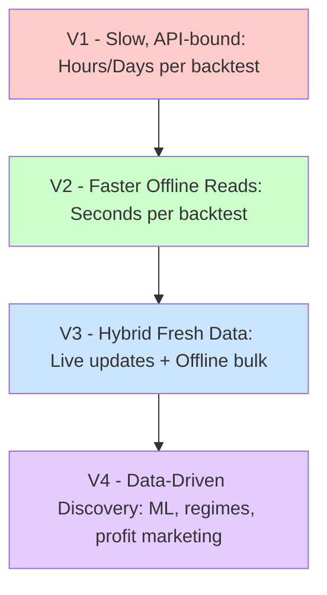

# Breaking the Speed Barrier: LIQUIDAI’s High-Performance Data Architecture

## Evolution at a Glance (V1 → V4)

**V1: Direct API Dependence** ✅
- **State:** Hummingbot’s built-in API candle fetching  
- **Bottleneck:** rate-limited, no DEX support

**V2: Offline Parquet Files** ✅
- **State:** Pre-downloaded historical data, local file reads  
- **Benefit:** Seconds per backtest, enabling overnight parameter sweeps  
- **Outcome:** Rapid iteration, precise profit scenario identification

**V3: Incremental Updates for Live Data** 🔧
- **State:** Hybrid approach—periodic API fetches feeding in-memory databases, not direct strategy queries  
- **Benefit:** Up-to-date data without losing speed advantages  
- **Outcome:** Both historically rich and live-relevant strategies

**V4: Advanced Analytics & ML** 🔧
- **State:** Fully leveraged fast access for ML-driven adaptation, scenario-based testing  
- **Benefit:** Uncover subtle patterns, adapt quickly, confidently showcase data-driven profit claims  
- **Outcome:** Cutting-edge strategies that inspire user confidence

---

## Introduction

Performance is not just a technical metric—it’s a strategic asset. We’ve evolved from V1’s direct API pulls to V2’s swift offline processing, through V3’s hybrid live-updates, and into V4’s advanced analytical horizons. This journey isn’t merely about cutting load times; it’s about unlocking entirely new capabilities—from discovering hidden profit potential to confidently marketing results backed by concrete data.

## The Challenge of API-Based Data Retrieval (V1) ✅

Initially (V1), direct API-based candle fetching was the default approach. While APIs promise deep historical data, they quickly falter under granular requests. Network latency, JSON parsing, and incremental queries accumulate, turning a year-long backtest into an hours-long ordeal.

### Real-World Experience Elsewhere

In a previous role, I was hired because the company’s daily API updates (~100,000 products) took over a month each refresh. After switching to CSV imports and running MySQL in RAM, the process dropped below an hour. This case shows how even modest datasets, repeatedly fetched via APIs, can balloon into severe delays due to overhead and latency.

### Data Volume Reality Check

For DEX data, a year of minute-level candles per pair is ~525,600 entries (~39 MB). Scale that to dozens or hundreds of pairs, and it’s gigabytes of data and thousands of paginated API requests. Even at one second per request, we’re talking hours for a single dataset. V1’s approach limited rapid testing and iteration.

## Offline Data and Parquet Files (V2) ✅

At V2, we adopted offline Parquet files, eliminating the API bottleneck for historical data. With this approach, we laid the foundation to move from merely waiting on data to actively innovating with it.
## Integrating Fresh Data for Live Trading (V3) 🔧

While V2 excelled historically, we still need fresh data for live trading. V3 will introduce a hybrid model:

- **Incremental Updates:** Periodically load fresh data from APIs into a high-speed in-memory database, not directly into the strategy at runtime.  
- **Result:** Strategies remain well-informed by historical depth and agile in the present market, all without returning to API-induced slowdowns.

## Advanced Analytical Horizons (V4) 🔧

V4 leverages the speed and accessibility built in earlier stages:

1. **Fully Automated Parameter Exploration:**  
   Rapid local access allows massive overnight parameter sweeps. We identify best-performing configurations and confidently feature them in marketing materials, showcasing data-backed profit potential.

2. **Machine Learning-Driven Adaptation:**  
   Immediate data access makes advanced ML workflows seamless. Models train and retrain quickly, leading to dynamically evolving strategies we can boast about as cutting-edge and data-driven.

3. **Scenario-Based Regime Testing:**  
   Automated segmentation of historical data into regimes (bullish, bearish, volatile, etc.) is now trivial. The strategy’s resilience can be documented and presented as proof that it thrives under various conditions—an assurance we can highlight to prospective users and investors.

## Future Directions

- **V3: Incremental Updates** – Next phase is to implement real-time incremental merges to close to gap between real time and outdated offline data
- **V4: Advanced Analytics & ML** – Suggested enhancements for automated parameter optimization, scenario-based testing, and ML-based adaption.

## Conclusion

By progressing from V1’s slow, API-driven approach to V2’s offline parity, V3’s hybrid updates, and ultimately V4’s advanced analytics and ML integration, we are poised to showcase truly eye-popping scenarios. While these extreme profit configurations might not be easily replicable by ordinary users, openly demonstrating their existence can still serve as a powerful incentive for customers to subscribe. In other words, this technical evolution doesn’t merely accelerate our workflows—it lets us display the full spectrum of our strategies’ capabilities, enticing prospective users through data-backed evidence of exceptional, if rare, profit opportunities.