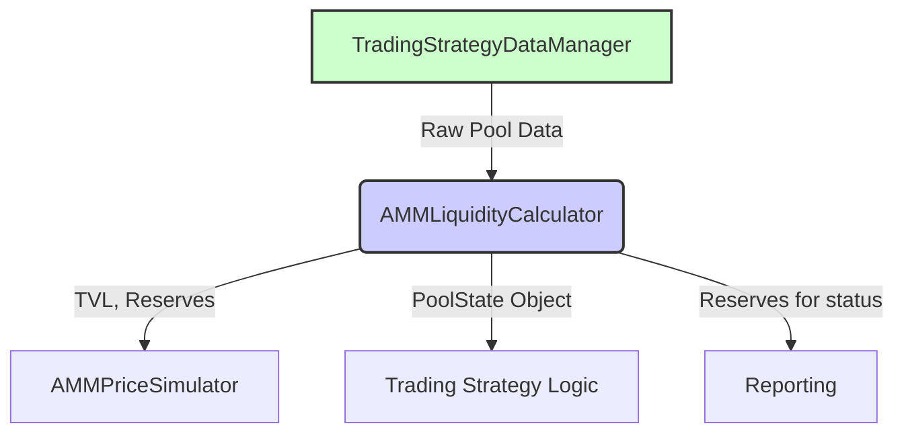

# AMM Liquidity Calculator

## Overview

The **AMM Liquidity Calculator** is a specialized module for converting between **different representations of pool reserves** used throughout the codebase. It aims to **separate** the “pool math” from the rest of the trading or backtesting logic, ensuring a clear boundary between data manipulation and strategy decisions.

- **TradingStrategy.ai Data Format**  
  As explained in[`XYLiquidity.md`](../Reference/TradingStrategy/XYLiquidity.md) TradingStrategy (our primary data source) expresses liquidity as **USD value of the quote reserves only**. 

- **Uniswap Data Format**  
  In contrast, most AMM dashboards (e.g., Uniswap’s web UI) show Total Value Locked (**TVL**) as the **sum of both reserves** in USD. 

#### For Example
- If a pool has 50 FOO ($100) and 50 USDC, the TradingStrategy would report liquidity as 50 USD.
- In contrast, Uniswap would show TVL as 150 USD (100 + 50).

By placing all conversions in one module, we maintain a **clear separation of concerns**: the rest of the code can focus on trading decisions, while this module handles pool math consistently. This cuts down on repeated logic, reduces cognitive load, and ensures faster iteration when we compare or validate data against external sources.

## Strategy Dataflow



## Functions
```python
def calculate_tvl(pool_state: PoolState) -> Decimal:
    """Convert TradingStrategy liquidity to Uniswap-style TVL for validation"""

def calculate_pool_state(quote_reserve_usd: Decimal, ...) -> PoolState:
    """Convert TradingStrategy quote reserve USD to pool token amounts"""

def get_pool_composition_usd(pool_state: PoolState) -> tuple[Decimal, Decimal]:
    """Get USD value of both reserves for status reporting"""
```

## PoolState Data Model

**PoolState** is a lightweight container class that describes the current state of an AMM pool in a single snapshot. Downstream components such as the `AMMMeanReversionBacktest` or the `AMMPriceSimulator` reference **PoolState** to access reserve amounts or convert them into more familiar metrics (e.g., total value locked, price, etc.).

### Fields

| Field             | Type    | Description                                                                                                         |
|-------------------|---------|---------------------------------------------------------------------------------------------------------------------|
| `reserve_base`    | Decimal | Current reserve of the **base** asset in the pool, typically a token you’re buying/selling (e.g., WETH, DOGE).      |
| `reserve_quote`   | Decimal | Current reserve of the **quote** asset in the pool (e.g., USDC, USDT).                                              |
| `base_price_usd`  | Decimal | The USD price of the base asset. Used primarily for conversions when calculating TVL or other USD metrics.          |
| `quote_price_usd` | Decimal | The USD price of the quote asset. If the quote token is already a stablecoin pegged to USD, this is typically ~1.00. |
