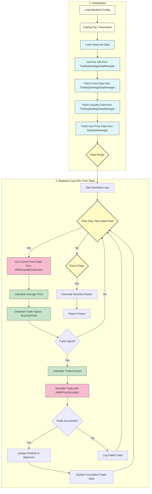

# AMM Mean Reversion Backtest Component

## Overview

The AMM Mean Reversion Backtest component simulates trading strategy performance using historical DEX pool data while accounting for realistic trading conditions including:

- Price impact from pool reserves 
- Gas costs and fee deductions
- Slippage simulation
- Portfolio balance tracking

## How It Works

1. **Data Retrieval:**  
   The backtest first fetches historical candle and liquidity data for the specified pair and timeframe using `TradingStrategyDataManager`. Gas data is fetched using `GasDataManager`.

2. **Average Price Calculation:**  
   For each day (or selected interval), it computes the moving average of the asset’s price over the chosen time window.

3. **Trade Signal Generation:**  
   - If current price < average price * (1 - threshold), it’s a BUY signal.
   - If current price > average price * (1 + threshold), it’s a SELL signal.
   - Otherwise, no trade is executed.

4. **Trade Simulation:**  
   On a trade signal, the strategy uses `AMMPriceSimulator` to:
   - Calculate the expected amount out based on current pool reserves.
   - Apply trading fees, slippage, and gas costs.
   - Update the pool’s reserves and the strategy’s balances accordingly.

5. **Performance Tracking:**  
   With each simulated trade, the system records:
   - P&L: How balances evolve over time.
   - Slippage costs: Difference between theoretical and realized price.
   - Gas fees: Deducted from quote (or base) balances, representing real trading friction.

6. **Result Compilation:**  
   At the end of the backtest, the component produces:
   - Final portfolio value in base/quote assets and USD.
   - Total number of trades, average slippage, cumulative gas fees.
   - Performance metrics (percentage returns, drawdowns, etc.)

## Backtest Execution Flow




## Core Implementation Details

1.  **Initialization and Setup:** The `AMMMeanReversionBacktest` initializes by taking parameters through its configuration, then loads all necessary historical data using the `TradingStrategyDataManager`. This involves fetching price and liquidity information from specific pairs and setting initial conditions.

    ```python
    def __init__(self, markets: Dict[str, ConnectorBase], config: AMMMeanReversionBacktestConfig):
        super().__init__(markets, config)
        ...
        self.data_manager = TradingStrategyDataManager(data_dir="data")
        self.gas_data_manager = GasDataManager(data_dir="data", chain=self.chain)
        ...
        self.load_historical_data()
    ```

2.  **Simulation Loop:** It iterates through the dataset’s historical records (i.e. candles/liquidity snapshots), calculating prices, assessing opportunities, simulating trades and managing the results.

    ```python
        for index, row in self.historical_data.iterrows():
            ...
            # Calculate pool state
            pool_state = calculate_pool_state(...)

            # Check for trade signals using generate_trade_signal function
            trade_signal = self.generate_trade_signal(current_price, average_price)

            # Execute trade
            (trade_executed, trade_amount_in, trade_amount_out, delta_base, delta_quote, trade_price, slippage_incurred) = self._process_trade(
                    pool_state, trade_signal, current_price, gas_fee)
    ```

3.  **Trade Execution:** The simulation of trading actions uses helper methods to orchestrate price simulation, cost calculation, and trade size management:

   ```python
    def _calculate_trade_amount(self, trade_type: str, current_price: Decimal) -> Decimal:
        # ... Calculate maximum trade size based on price and balances
    def _process_trade(self, pool_state: dict, trade_type: str, current_price: Decimal, gas_fee: Decimal) -> tuple:
        # Get amount of token to trade
        # Calculate outcome using AMMPriceSimulator
        # Update balances

   ```

4. **Results Collection**: The backtesting results including timestamp, price info, balance tracking, and metrics for every day are added to DataFrame and exported in CSV.

    ```python
            results.append({
                'timestamp': timestamp,
                'current_price': current_price,
                ...
                'gas_balance': self.current_gas_balance,
                'base_balance': self.current_base_balance,
                'quote_balance': self.current_quote_balance,
            })
       self.results_df = pd.DataFrame(results)
        self.results_df.to_csv(f"data/backtest_{self.trading_pair}_{self.threshold}_threshold.csv", index=False)
    ```
5. **Trade and Performance Reporting**: The simulation output is then transformed and prepared for printing in user readable way. This part provides overview, trade results, balances, and P&L.

  ```python
   def get_trades_df(self, df):
      ... # extract number of trades and
   ```

## Output Metrics

After the backtest is complete, here are some key metrics available:
- **Backtest Period:**
    -   Start Time, End Time
    -   Total Duration

-  **Configuration:**
    -   Exchange Name, Chain, Trading Pair
    -   Threshold, Trade Amount
-  **Initial and Final Pool States:**
    -   TVL, prices and reserve amounts in USD

-  **Gas Balance Summary:**
    -   Total Gas Used
    -   Remaining Gas balance

-  **Trades Analysis:**
    -   Number of buy and sell trades
    -   Total trade volume in base and quote assets
    -   Average prices for executed trades

- **Performance Analysis**:
    -  Total portfolio value at start and end
    -  Total gas fees (native and USD)
    -  Slippage cost (native and USD)
    -  Total P&L and percentage return.

## Error Handling and Fallbacks

The AMMRB has different fallbacks that guarantee graceful operation under all market circumstances:

1. **Pair Information Errors**: Missing pair information leads to backtesting cancellation, rather than running the simulation with incorrect parameters:

   ```python
       if pair_info is None:
            self.logger().error("Pair information not found for the given exchange and tokens.")
            raise ValueError("Invalid trading pair.")
    ```

2. **Insufficient Gas**: Simulation of trades stops if there are insufficient gas funds:
   ```python
      if self.current_gas_balance < gas_fee:
           self.logger().warning(f"Insufficient gas balance ({self.current_gas_balance:.8f} for {gas_fee:.8f})")
           return no_trade_result
   ```
3. **Unsuccessful Trade Simulation**: Simulation failures result in failed trades, making sure no trades are executed under extreme conditions:
    ```python
         simulation_result = self._simulate_trade(pool_state, amount_in, trade_type)
         if not simulation_result:
            self.logger().warning("  Trade simulation failed")
            return no_trade_result
    ```

## Future Directions

- **Price Impact in Trading Decisions**
   Currently price impact only affects PnL calculation, not trading decisions. Should simulate AMM price impact before generating signals, similar to how CEX implementation uses order_book.get_price_for_volume.
