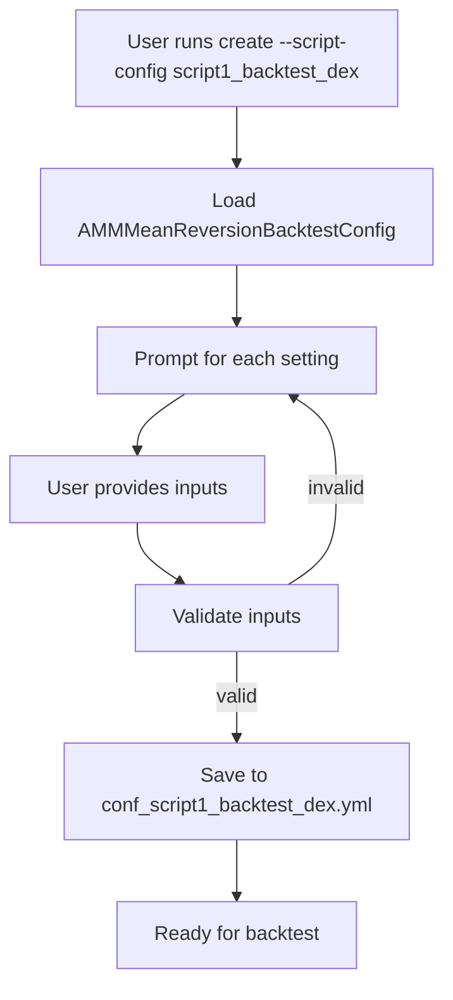

# AMM Mean Reversion Backtest Configuration

## Overview
Hummingbot uses `AMMMeanReversionBacktestConfig` to collect and validate DEX mean reversion strategy parameters through its configuration wizard:

```bash
create --script-config script1_backtest_dex
```

This configuration defines the parameters needed for backtesting, from trading pair details to slippage and gas buffers.

## Key Parameters

### Trading Environment
- **chain**: Blockchain network (`ethereum`, `polygon`)
- **network**: Network type (`mainnet`)
- **exchange_slug**: DEX identifier (`uniswap-v2`) 
- **trading_pair**: Trading pair (`WETH-USDT`)
- **pair_contract_address**: Optional specific pool address

### Strategy Settings
- **time_window_days**: Days for moving average calculation
- **threshold**: Price deviation trigger (0-1, e.g. 0.05 for 5%)
- **amount**: Base asset amount per trade
- **slippage**: Maximum acceptable slippage
- **gas_fee_buffer**: Extra gas fee buffer (e.g. 0.05 for 5%)

### Backtest Parameters
- **initial_base_balance**: Starting base token amount
- **initial_quote_balance**: Starting quote token amount
- **backtest_days**: Historical period to simulate
- **update_interval**: Strategy check frequency in seconds

## Configuration Flow


## Example Configuration
```yaml
markets:
  uniswap_ethereum_mainnet: []
candles_config: []
controllers_config: []
config_update_interval: 60
chain: ethereum
network: mainnet
exchange_slug: uniswap-v2
chain_slug: ethereum
trading_pair: WETH-USDT
time_window_days: 20
threshold: 0.04
amount: 1
update_interval: 60.0
slippage: 0.01
gas_fee_buffer: 0.05
initial_base_balance: 0
initial_quote_balance: 5000.0
backtest_days: 100
```

## Usage Notes
- All parameters validated during interactive configuration 
- Configuration saved to `conf_script1_backtest_dex.yml`
- YAML file can be manually edited after creation

## Future Directions

- **Dashboard for Pair Exploration:**
    - Users need clear visual feedback on what pairs are available
    - Manual verification too technical for regular users
  - Phase 1 (Optional): Developer tools 
    - Less critical as developers can verify data availability manually
    - Could speed up future strategy development
  - Phase 2 (Required): User-facing dashboard
    - Critical, because multiple "pair not found" errors feel like system failure
    - Manual pools analysis is time-consuming
    - Requires prior implementation of bot developent / management system and blending into existing UI design
  - Phase 3 (Optional): Enhanced features
    - Whale activity monitoring
    - Advanced analytics
    - Trading opportunity signals
- **markets / candles_config / controllers_config**
  - Get rid of reliance on relevant hummmingbot classes to remove unnecessary config entries  
- **gas_fee_buffer**
  - Drop or implement support
