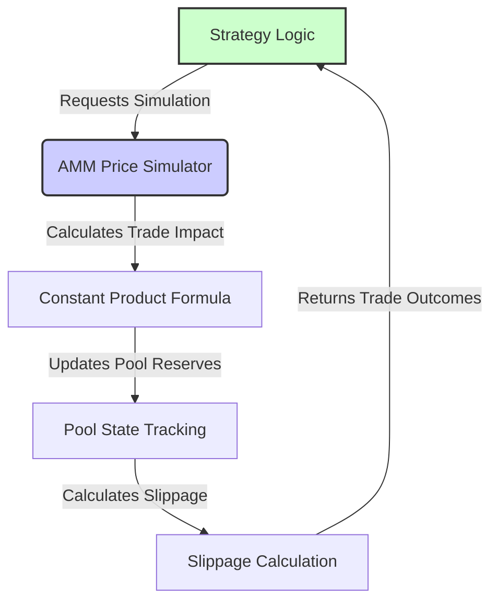

# AMM Price Simulator Component

## Overview

The AMM Price Simulator (AMMPS) is a core component for accurately modeling trade executions on Uniswap V2-style constant product AMMs. By applying the protocol’s formula to simulate how swaps alter pool reserves, it precisely calculates price impact, slippage, and resulting trade amounts. This level of detail is critical for smaller or less liquid pools, where even modest trades can cause substantial slippage—often enough to erode profits entirely.

By centralizing trading logic, the AMMPS promotes a clear separation of concerns, allowing strategy logic to remain focused on decision-making rather than AMM dynamics. This clear division of concerns reduces cognitive load, enabling rapid iteration, deeper insights, and more confident decision-making.

## Why Price Impact Matters: A Real Example

During development, we encountered an illuminating case with the DOGE-WETH pool that demonstrates why price simulation is crucial:

### Initial Testing: Oversized Trade
```python
Initial Pool State:
  Base Reserve: ~200M DOGE
  Quote Reserve: ~8 WETH
  TVL: ~$40K USD

Trade Result:
  Size: Large (Significant % of pool reserves)
  Price Impact: Severe (>40%)
```
**Profit: -800%** ❌

### Optimized Approach
```python
Same Pool:
  Similar initial reserves
  Similar market conditions

Trade Result:
  Size: Reduced to small % of pool reserves
  Price Impact: Minimal (<0.5%)
```
**Profit: +30%** ✅

This real test case demonstrates why accurate price impact simulation is crucial - what appears to be a profitable opportunity can become a significant loss if trade size isn't properly calibrated to pool liquidity. The AMMPriceSimulator helps strategies avoid these pitfalls by modeling trade impact before execution.

## Simulation Workflow

The AMMPS sits at the heart of every trade, whether in backtesting or live trading. It provides a granular view of trade impact before a transaction is executed, using real-time pool reserves to forecast trade outcomes:



## Core Implementation Details

### Inputs

- `reserve_base` (Decimal): The current reserve quantity of the base asset in the pool.
- `reserve_quote` (Decimal): The current reserve quantity of the quote asset in the pool.
- `amount_in` (Decimal): The amount of input tokens provided for the trade.
- `trade_type` (str): The direction of the trade (`"buy"` or `"sell"`).
- `fee` (Decimal, optional): The trading fee applied (e.g., `0.003` for a 0.3% fee).

### Outputs

- `amount_out` (Decimal): The quantity of the output token received after the swap.
- `trade_price` (Decimal): The effective execution price of the trade.
- `slippage` (Decimal): The percentage deviation of the trade price from the initial spot price.
- `new_reserve_base` and `new_reserve_quote` (Decimal): The updated pool reserves following the trade.

### Simulation Steps

1. **Spot Price Calculation:**
   Compute the pool’s current spot price before the trade:
   ```python
   spot_price = reserve_quote / reserve_base
   ```

2. **Fee Application:**
   Deduct the trading fee from `amount_in`:
   ```python
   amount_in_with_fee = amount_in * (Decimal('1') - fee)
   ```

3. **Constant Product Formula:**
   Use the `x * y = k` model to determine `amount_out`. The formula differs slightly depending on whether you’re buying or selling:

   - **Buy (quote to base):**
     ```python
     amount_out = (reserve_base * amount_in_with_fee) / (reserve_quote + amount_in_with_fee)
     ```
   - **Sell (base to quote):**
     ```python
     amount_out = (reserve_quote * amount_in_with_fee) / (reserve_base + amount_in_with_fee)
     ```

4. **Update Reserves:**
   Adjust the pool’s reserves to reflect the trade:
   ```python
   if trade_type == 'buy':
       new_reserve_base = reserve_base - amount_out
       new_reserve_quote = reserve_quote + amount_in
   else: # trade_type == 'sell'
       new_reserve_base = reserve_base + amount_in
       new_reserve_quote = reserve_quote - amount_out
   ```

5. **Slippage Calculation:**
   Compute the executed trade price and compare it to the spot price to find slippage:
   ```python
   # For buy trades, trade_price = amount_in / amount_out
   # For sell trades, trade_price = amount_out / amount_in
   
   if trade_type == 'buy':
       trade_price = amount_in / amount_out if amount_out != Decimal('0') else Decimal('0')
       slippage = (trade_price - spot_price) / spot_price if spot_price != Decimal('0') else Decimal('0')
   else:
       trade_price = amount_out / amount_in if amount_in != Decimal('0') else Decimal('0')
       slippage = (spot_price - trade_price) / spot_price if spot_price != Decimal('0') else Decimal('0')
   ```

## Error Handling and Edge Cases

1. **Insufficient Liquidity**
   If the trade size is too large, causing pool reserves to go negative, the simulator rejects the trade to maintain realistic conditions.

   ```python
   if new_reserve_base <= 0 or new_reserve_quote <= 0:
       raise ValueError("Trade amount is too large; not enough liquidity.")
   ```

2. **Invalid Trade Type**
   The simulator accepts only `"buy"` or `"sell"` as valid trade directions. Any other value results in an immediate error.

   ```python
   if trade_type not in ['buy', 'sell']:
       raise ValueError("Invalid trade type. Use 'buy' or 'sell'.")
   ```

3. **Division by Zero or Output Checks**
   If the calculation results in an output amount of zero, the simulator ensures it does not attempt a division by zero. Instead, it sets the trade price and slippage-related values to zero gracefully.

   ```python
   trade_price = amount_in / amount_out if amount_out != Decimal('0') else Decimal('0')
   ```

4. **Precision Control**
   All calculations use Python’s `Decimal` to maintain consistent precision and avoid floating-point rounding issues.

   ```python
   from decimal import Decimal
   # All key calculations use Decimal for high-precision arithmetic.
   ```

By handling these scenarios gracefully, the simulator ensures that no unrealistic trades are processed and that users receive immediate, clear feedback when their input parameters or requested trades fall outside reasonable bounds.

### Future Directions

1. **Real-time Trade Sizing:**  
   Implementing a method to dynamically determine the maximum trade size that meets a specified slippage threshold would enhance real-time trading scenarios. By determining the optimal amount to trade based on current reserves and slippage constraints, the simulator would allow strategies to confidently execute trades that maintain profitability and risk tolerance.

2. **Concentrated Liquidity:**  
   Currently, the simulator implements the constant product math for V2-style AMMs, but does not support the concentrated liquidity that V3 introduced. Incorporating V3-style tick calculations and liquidity range management would more closely align simulations with real market conditions.

3. **Dynamic Fee Structures:**
   Introduce support for variable fees (as seen in V3 and beyond), allowing the simulator to adjust fees based on market conditions or other logic. This creates a more responsive and realistic trading environment, better reflecting evolving AMM standards.

4. **Selective Adoption of V4 Enhancements:**
   While fully integrating Uniswap V4’s features may be complex, selectively incorporating certain improvements—such as simplified fee adjustments or accounting efficiencies—can help keep the simulator aligned with the latest AMM innovations without overcomplicating the model.
