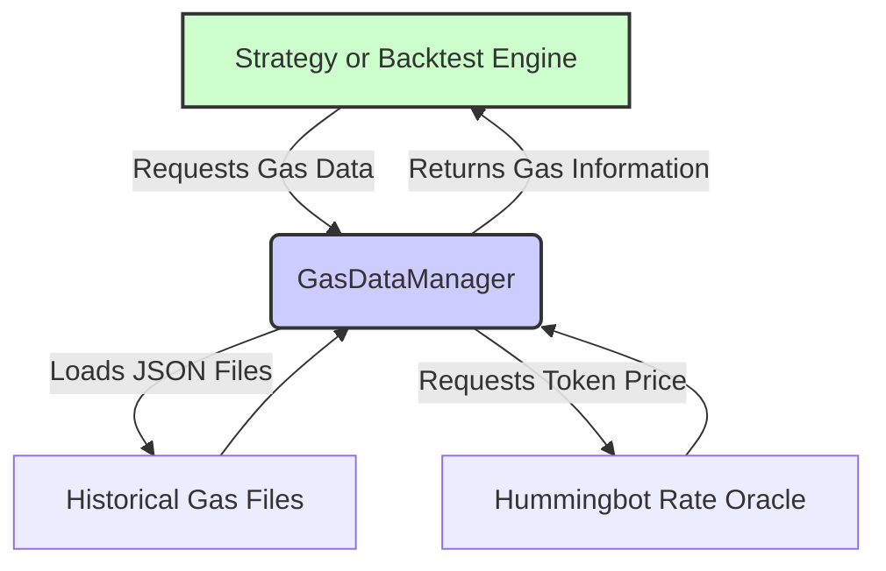

# Gas Data Manager

## Overview

The Gas Data Manager (GDM) is responsible for loading, processing, and providing historical and current gas price data, ensuring that our DEX strategies can accurately estimate transaction costs.

The Gas Data Manager (GDM) supports our **V4 vision** by replacing API-dependent gas cost calculations with offline data derived from [Owlracle](https://owlracle.info).  For details on how local data sources accelerate backtesting and enable more complex tests, see our [Data Performance Documentation](doc/Architecture/DataPerformance.md).

By centralizing gas data handling, the GDM promotes a clear separation of concerns, allowing strategy logic to remain focused on decision-making rather than cost calculations. This modular approach simplifies maintenance, supports independent refinement of components, and ensures data integrity as we expand our capabilities.

## Architecture and Data Flow


## Design Decisions and Rationale

**Why Owlracle?**  
We could download year’s worth of daily gas price data immediately, without subscriptions or complex scripts, allowing us to quickly integrate realistic gas costs into backtesting. The daily OHLC format helps us gauge price variability and decide later if higher granularity is needed.

**Why JSON Files Initially?**  
JSON was the fastest way to get started. It’s easy to parse and human-readable, letting us integrate gas data into the backtesting pipeline right away. While not the most efficient long-term, this approach minimized setup overhead and got the system running quickly.

**Why This Data Structure?**  
We kept the original Owlracle format (daily OHLC, timestamp, avgGas, samples) to avoid unnecessary data transformations. This let us start testing realistic gas costs immediately. Once validated, we can later optimize formats (e.g., move to Parquet).

**Minimal Rate Oracle Queries**  
We only query the RateOracle once per backtest and cache the result, ensuring this integration doesn’t slow down the simulation. This maintains the performance benefits of our offline data approach.


### Data Format Details

The GasDataManager currently reads gas price information from a JSON file conforming to a structure like:

```json
[
  {
    "timestamp": "2024-09-15T00:00:00Z",
    "gasPrice": {
      "open": 20.5,
      "close": 22.3,
      "low": 18.0,
      "high": 25.0
    },
    "avgGas": 150000,
    "samples": 1440
  },
]
```

- **timestamp**: Daily record date in ISO 8601 format (UTC).
- **gasPrice**: Object containing daily OHLC data in Gwei.
- **avgGas**: Average gas used per transaction that day (integer).
- **samples**: Number of samples recorded that day (typically close to 1440 for one sample per minute).

## Core Methods and Usage

### Initialization
```python
gas_manager = GasDataManager(data_dir="data", chain="ethereum")
```
- **data_dir:** Directory containing gas data files (e.g., `gas_eth.json`).
- **chain:** Target blockchain (e.g., "ethereum", "polygon").

### Fetching Gas Info
```python
date = datetime(2024, 9, 15)
gas_info = gas_manager.get_gas_info_by_date(date)
```
- Retrieves gas details for the given date.
- If no exact match, uses the closest available date’s data.
- Logs a warning if a fallback date is used.

### Calculating Gas Fees
```python
gas_fee_native = gas_manager.calculate_gas_fee(gas_info)
gas_fee_usdt = gas_manager.calculate_gas_fee_in_usdt(gas_info)
```
- **calculate_gas_fee:** Returns fee in the chain’s native currency (e.g., ETH, MATIC).
- **calculate_gas_fee_in_usdt:** Converts gas fee to USDT using a cached price fetched from RateOracle.

## Core Implementation Details

Here are key implementation details to provide further context:

1. **JSON File Loading:** The `GasDataManager` loads gas data from JSON files using Python's `json` library. This is shown in the following example:

    ```python
    def __init__(self, data_dir: str = "data", chain: str = "ethereum"):
        ...
        file_path = Path(data_dir) / gas_files[chain]
        if not file_path.exists():
            raise FileNotFoundError(f"Gas data file not found: {file_path}")
    ```

2. **Dataframe Creation:** The loaded JSON data is then converted into a Pandas DataFrame for further analysis and filtering.
    ```python
        with open(file_path, 'r') as f:
            gas_data = json.load(f)
        self.gas_df = pd.DataFrame(gas_data)
    ```

3. **Gas Fee Calculation:** The `calculate_gas_fee` function uses the gas price data to compute an estimated gas fee for the transaction. Note that the estimated gas is dependent on the chain being used, and an average is used if the chain can't be found.

    ```python
    def calculate_gas_fee(self, gas_info: dict) -> Decimal:
        """Calculate gas fee in native chain coin (ETH, MATIC, etc.)"""
         gas_used = {
                "ethereum": Decimal('150000'),
                "polygon": Decimal('120000'),
                "binance-smart-chain": Decimal('130000'),
                "avalanche": Decimal('130000'),
                "celo": Decimal('100000'),
            }.get(self.chain, Decimal('150000'))  # Default to 150k if chain not found

        gas_price = Decimal(str(gas_info['gasPrice']['close']))  # In Gwei
        gas_price_native = gas_price * Decimal('1e-9')  # Convert Gwei to native coin
        gas_fee = gas_used * gas_price_native

        return gas_fee
    ```

4.  **Gas Fee in USDT Calculation** The `calculate_gas_fee_in_usdt` function converts the native gas fee to USDT using the `RateOracle`:
    ```python
    def calculate_gas_fee_in_usdt(self, gas_info: dict) -> Decimal:
        """Calculate gas fee in USDT"""
        gas_fee_native = self.calculate_gas_fee(gas_info)  # Gets fee in native coin
        return gas_fee_native * self.get_gas_coin_price()  # Convert to USDT

    ```

### Error Handling and Edge Cases

- **Missing Date**: If the exact requested date is not found, the GasDataManager automatically locates the nearest available date, logs a warning, and returns that day’s data. Code snippet included in the Core Implementation section above.

    ```python
    def get_gas_info_by_date(self, date) -> dict:
        """Get gas info for a specific date or the nearest available date."""
        ...

        date_str = date.strftime('%Y-%m-%d')
        gas_info = self.gas_df[self.gas_df['timestamp'].dt.strftime('%Y-%m-%d') == date_str]

        if gas_info.empty:
            # Logic to find nearest date
            ...
            self.logger().warning(f"No gas data for {date_str}, using nearest available date: {nearest_date}")
        ...
    ```

-   **Invalid Gas Coin Price:** If the RateOracle fails to return a valid gas coin price (e.g., due to network issues or missing pair data), the `GasDataManager` raises a `ValueError`:

    ```python
        def get_gas_coin_price(self) -> Decimal:
        """Get gas coin price in USDT. Fetches only once and caches the result."""
        if self._gas_coin_price is None:
            ...
            price = RateOracle.get_instance().get_pair_rate(pair)

            if not price or price <= 0:
                raise ValueError(f"Unable to get price for {pair} from RateOracle")
            ...
    ```

- **Missing File**: If the designated gas data file doesn’t exist at the expected path, a `FileNotFoundError` is raised:
    ```python
        if not file_path.exists():
            raise FileNotFoundError(f"Gas data file not found: {file_path}")
    ```
    
- **Unsupported Chain**: If the requested chain is not in the pre-defined mapping of supported chains, a `ValueError` is raised:
    ```python
        gas_files = {
            "ethereum": "gas_eth.json",
            "polygon": "gas_matic.json",
            "binance-smart-chain": "gas_bnb.json",
            "avalanche": "gas_avax.json",
            "celo": "gas_celo.json"
        }

        if chain not in gas_files:
            raise ValueError(f"Unsupported chain: {chain}. Supported chains: {list(gas_files.keys())}")
    ```
    
- **Unsupported Chain for Gas Coin Pairs**: Similarly, when determining the gas coin price, if the chain doesn’t match any known pairs, another `ValueError` is raised:
    ```python
            gas_coin_pairs = {
                "ethereum": "ETH-USDT",
                "polygon": "POL-USDT",
                "binance-smart-chain": "BNB-USDT",
                "avalanche": "AVAX-USDT",
                "celo": "CELO-USDT"
            }

            if self.chain not in gas_coin_pairs:
                raise ValueError(f"Unsupported chain: {self.chain}")
    ```


## Future Directions

1. **More Granular Intervals:**  
   Currently, the GDM relies on daily gas price candles. To better capture intraday volatility and reflect short-term market conditions, we plan to introduce higher-resolution data (e.g., 1-minute intervals). More granular data will allow for more precise backtesting and more accurate assessments of short-lived trading opportunities.

2. **Data Collection and Accumulation Scripts:**  
   To support 1-minute granularity, we will develop scripts to continuously fetch and store gas price data from Owlracle, creating a rolling dataset that captures rapid market shifts. This will involve automating the data pipeline and ensuring reliable, time-aligned snapshots of gas prices throughout the day.

3. **Parquet Migration for Efficiency:**  
   As data volume grows with finer intervals, we will have to migrate from JSON to Parquet for efficient storage and retrieval. Parquet’s columnar format and compression capabilities will become necessary to optimize performance, reduce storage overhead, and maintain fast data access for backtesting and analysis.

4. **Multi-Chain Support:**  
   Presently, the GasDataManager focuses on Ethereum mainnet. Although gas costs on certain networks like Polygon are comparatively low, we still need to gather and maintain gas data for other chains supported by Hummingbot’s Uniswap connectors, for accurate backtesting results.

## Real-World Gas Costs (Late 2024)

### Ethereum Mainnet
- Low: 15-25 Gwei (~$20-30)
- Normal: 30-50 Gwei (~$40-60) 
- High: 100-200 Gwei (~$120-240)
- Peak: 500+ Gwei (~$600+)

### Polygon
- Low: 30-50 Gwei (~$0.02-0.03)
- Normal: 100-200 Gwei (~$0.06-0.12)
- High: 300-500 Gwei (~$0.18-0.30)

### BSC
- Relatively stable: 5-7 Gwei (~$0.15-0.20)
- High periods: 10-15 Gwei (~$0.30-0.45)
