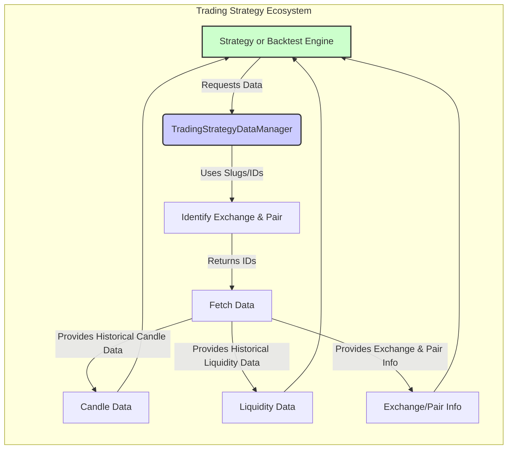

# Trading Strategy Data Manager Component

The TradingStrategyDataManager (TSDM) is the **core component** enabling us to progress from slow, hours-long data handling to the **V4 vision** of automated parameter exploration and scenario-based testing. By leveraging local, columnar data storage, TSDM cuts multi-hour data loads down to seconds, making advanced analyses and seamless experimentation standard practice. For more on the efficiency and capabilities TSDM unlocks, see our [Data Performance Documentation](doc/Architecture/DataPerformance.md).

Equally important, the TSDM separates data retrieval from strategy logic. Instead of getting bogged down in raw file parsing or custom filtering, we can focus purely on trading ideas and their validation. This clear division of concerns reduces cognitive load, enabling rapid iteration, deeper insights, and more confident decision-making.

## Key Responsibilities

1. **Historical Data Retrieval:**  
   Load large historical datasets (OHLCV candles, liquidity snapshots, exchange metadata) from Parquet files, enabling rapid iterative backtesting without reliance on external data sources.

2. **Exchange & Pair Identification:**  
   Translate parameters (e.g., chain slugs, exchange slugs, token symbols) into internal IDs and addresses, providing a consistent interface to diverse DEX environments.

3. **Date Range & Filtering:**  
   Allow precise control over time windows and intervals (e.g., daily or hourly data), reducing unnecessary data loading and focusing on the exact historical periods needed.

4. **Caching & Performance Optimization:**  
   Use caching, chunked reads, and columnar data access to minimize redundant operations and improve execution speed, enabling strategies to test multiple scenarios efficiently.

## Data Processing Flow

The TSDM acts as a translator, bridging the gap between our strategy's requests and the complexity of DEX data. When our strategy says, 'I need ETH-USDC price data from last month,' the TSDM figures out how that corresponds to a specific dataset on the hard drive, retrieves the needed information, formats it properly, and then provides that data ready for simulations.



## Core Implementation Details

The TSDM leverages several key technologies and techniques to achieve its performance and data integrity goals:

1.  **Parquet Files and `pyarrow`:** We use the Parquet format for storing historical data, combined with `pyarrow` for fast, columnar data access. This allows us to read only the necessary columns and data subsets, resulting in significant I/O performance gains.

    ```python
        def get_candles(self, ...):
            filename = f"candles-{timeframe}.parquet"
            self._candle_files[cache_key] = pq.read_table(
                self.data_dir / filename,
                filters=[('pair_id', '=', pair_id)], # Efficient filter
                columns=['timestamp', 'close', 'high', 'low'] # Select columns
            ).to_pandas()
        ...
    ```

2. **In-Memory Caching:** The TSDM caches frequently accessed metadata using Python dictionaries. This ensures that information like exchange details, pair mappings, and column schemas are not re-loaded for every data access request. It also caches the results of specific filtering operations, further improving performance.
    ```python
        def get_pair_info(self, ...):
            if self._pairs is None:
                self._pairs = pq.read_table(...).to_pandas()
            ...
            mask = ...
            return  self._pairs[mask].iloc[0] # Result cached in the self._pairs attribute
    ```
3. **Chunked Reads:** When processing massive datasets, the TSDM uses chunked data reads. Instead of loading entire Parquet files into memory, it reads the data in smaller, manageable chunks. This technique not only reduces memory footprint but also enables the system to start processing data before the full file is loaded, which improves data loading time.
    ```python
        def get_candles(self, ...):
            reader = pq.ParquetFile(self.data_dir / filename)
            for batch in reader.iter_batches(columns=['timestamp', 'close']):
                df = batch.to_pandas()
                # processing data here
                # caching results for further use
        ...
    ```
4. **Columnar Access:** By taking advantage of columnar access, the TSDM only loads the relevant columns from the dataset rather than the entire row. For example, if the strategy needs only timestamp, close, and volume data, it will not load all other candle data.
    ```python
        def get_candles(self, ...):
            self._candle_files[cache_key] = pq.read_table(
            ...,
            columns=['timestamp', 'close', 'volume'] # Only load these columns
        ).to_pandas()
    ```

## Error Handling and Fallbacks

The TSDM aims to ensure the data it provides is both consistent and complete. Currently, the intended approach includes:

*   The TSDM will attempt to resolve missing trading pair metadata by using token symbols if the contract address is not specified. For example, `get_pair_info()` function will attempt to match tokens by their symbol, rather than just by exact contract address.
    ```python
    def get_pair_info(...):
        ...
        if pair_contract_address:
            mask =  self._pairs['address'] == pair_contract_address
        else:
            mask = (
                (self._pairs["base_token_symbol"] == base_token) &
                (self._pairs["quote_token_symbol"] == quote_token)
            )
        return  self._pairs[mask].iloc[0]
    ```
*   **Missing Pair ID Handling:** If the TSDM is unable to locate data for a specific pair ID, it will log a warning and return `None`, signaling to the strategy that the data for this particular pair is unavailable and preventing potential backtest crashes. This ensures that missing data doesn't lead to unexpected behavior or incorrect calculations.
    ```python
        def get_candles(...):
           ...
           try:
                pair_data = self._pairs[mask].iloc[0]
           except IndexError:
               self.logger().warning(f"No pair found for {exchange_slug}, {chain_slug}, {base_token}, {quote_token}")
               return None
           ...

    ```

## Candle & Liquidity Schemas

- **Candle Data** is loaded and returned in the structure defined in [`Candle.md`](../Reference/TradingStrategy/Candle.md). That doc details the OHLCV fields (`open`, `high`, `low`, `close`, `volume`) plus extra metadata (e.g., `timestamp`, `exchange_rate`) the strategy might need.
- **Liquidity Data** is loaded and processed using the schema in [`XYLiquidity.md`](../Reference/TradingStrategy/XYLiquidity.md). The TSDM fetches daily (or hourly) TVL/reserve data, merges it to candle data if requested, and returns a combined DataFrame with time-based alignment.

## Future Directions

*   **Consolidated Data Retrieval:** Refactor data loading to provide a single entry point, returning merged data for a given period, eliminating the need for the strategy to manage multiple data sources (candles, liquidity, etc.) separately. This will significantly reduce the cognitive burden on strategy logic and improve maintainability.
*   **Automated Data Validation:** Implement automated and more detailed data validation by using helper functions:
    *   Check for data continuity within historical price/liquidity data by verifying that there are no gaps in the time series. This includes proper date/time handling and proper intervals of data points.
    *   Implement logic to check if prices are within reasonable ranges, and are consistent with known price trends.
*  **Performance Profiling:** Integrate tools and techniques for performance profiling within the TSDM, allowing for the identification of bottlenecks and areas for optimization. This will be especially crucial in V4 for efficient large-scale backtests, ML model training, and advanced analytics workflows that require rapid data processing.
